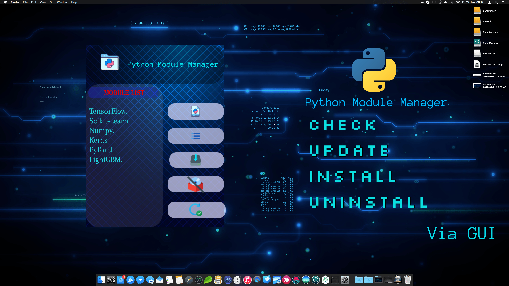

# Python Module Management

It is a Free GUI App that helps you to Manage Your Python Module Management. Easy to Install and Use.

# Feature
- Check Python Update
- check installed Module List
- Install module
- Uninstall Module
- Update Module

